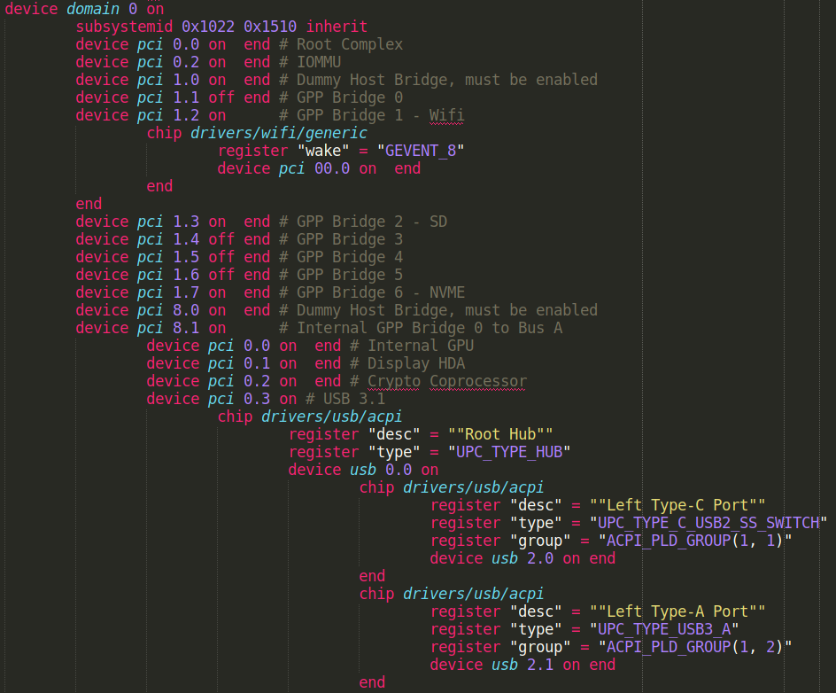

# Coreboot Syntax for Sublime Text

This package contains syntax definitions that make working on coreboot
easier.

## Currently supported syntaxes:

### Coreboot Device Tree

Device tree device aliases are also supported. This allows jumping between references and
definitions of device tree devices.

Coming Soon:

* C - There is [PR](https://github.com/sublimehq/Packages/pull/1831) that
  drastically improves the C syntax definition.
* Kconfig
* ASL

## Contributions

This repository is currently hosted at [review.coreboot.org](https://review.coreboot.org/). After creating an account clone the
[sublime-text-coreboot-syntax](https://review.coreboot.org/admin/repos/sublime-text-coreboot-syntax) repo.

See the
[guidelines](https://doc.coreboot.org/getting_started/gerrit_guidelines.html) for more information.

## License

This repository is licensed under the `MIT` license. For some parts, which were derived from other projects, other licenses may apply. Please check the individual source files for details.
